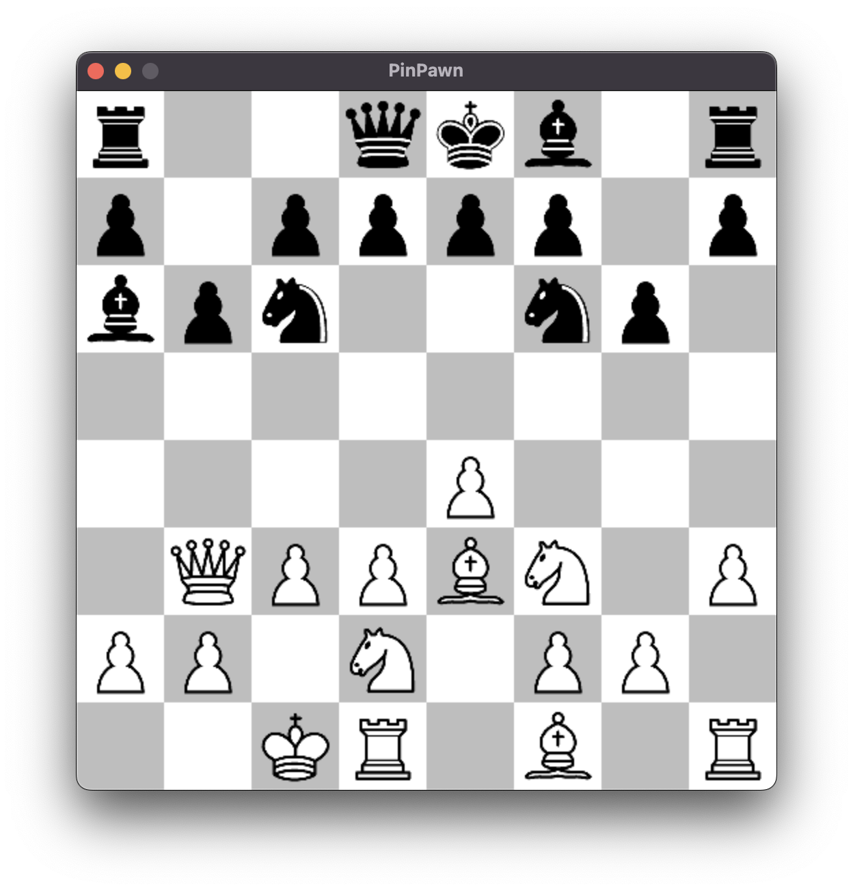
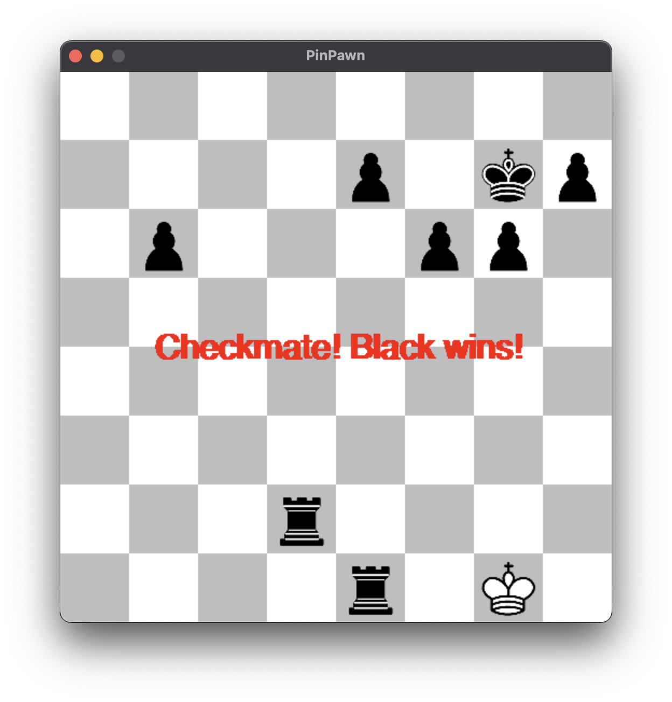

# PinPawn ♟️


A fully FIDE-compliant chess engine built from scratch in Python. Designed and built to demonstrate object-oriented architecture, state management, and algorithmic game theory implementation.

| Main Menu | Gameplay | Checkmate |
|:---:|:---:|:---:|
|  |  |  |

## 🚀 Overview

**PinPawn** is a chess engine that features a **clean GUI**, a **rule-enforcing engine**, and a **custom AI opponent**. Despite being smaller than 1 MB, this project implements the full complexity of chess rules in a modular and maintainable codebase.

## ✨ Key Features

*   **Full FIDE Compliance:** correctly handles all standard moves plus special rules (*castling*, *en passant*, *pawn promotion*, etc.).
*   **Custom AI Opponent:** the game AI is built using the **Minimax algorithm with alpha-beta pruning**, with an adjustable difficulty setting.
*   **Move Validation:** every move is checked to ensure it is legal under FIDE rules (*i.e.*, preventing the king from moving into check).
*   **Smarter Evaluation:** in addition to material value, the AI uses **Piece-Square Tables (PSTs)** to understand positional advantages.
*   **Interactive GUI:** built with PyGame, the GUI features a settings menu and a simple and intuitive gameplay.

## 🛠️ Technical Highlights

This project was built to showcase core computer engineering concepts:

*   **Algorithms:** implemented **Minimax** for decision making and **alpha-beta pruning** to optimize the search tree, allowing the AI to look ahead multiple moves much more efficiently.
*   **Object-Oriented Design:** the codebase is strictly separated into `Game` (rules/logic), `Board` (state), and `Piece` (data) classes to ensure separation of concerns.
*   **Heuristics:** the AI evaluation function goes beyond simple point counting, using **positional heuristics** (*e.g.*, encouraging knights to control the center, pawns to advance, etc.) to mimic human intuition.
*   **State Management:** solved the problem of checking legal moves by implementing a state-preservation system that simulates moves, to verify legality without corrupting the active game board.

## 💻 Installation & Usage

1.  Clone the repository
    ```bash
    git clone https://github.com/yourusername/PinPawn.git
    cd PinPawn
    ```

2.  Install dependencies
    ```bash
    pip install pygame
    ```

3.  Run the Game
    ```bash
    python main_gui.py
    ```

## ⚖️ License

This project is open source and available under the [MIT License](LICENSE).